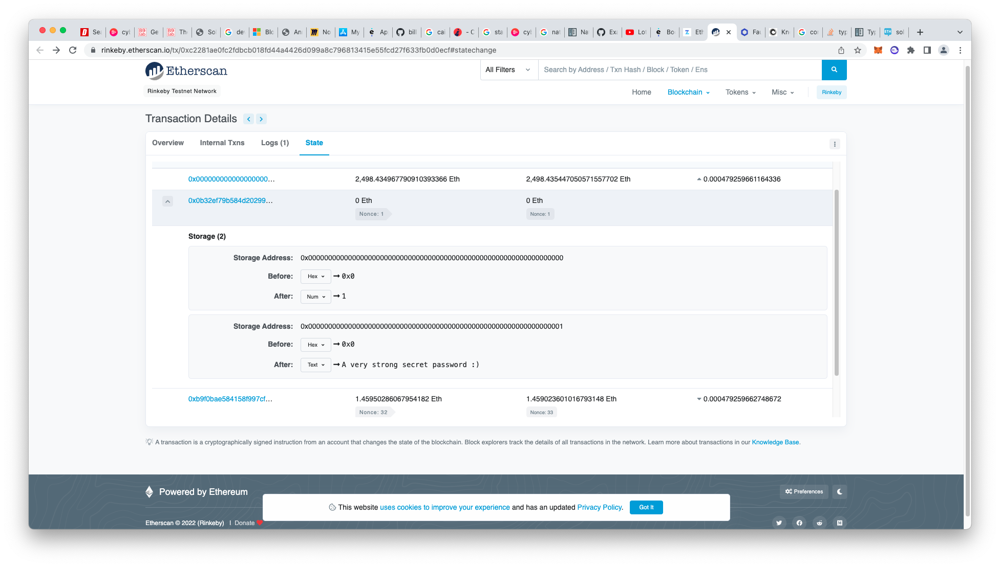

# 8. Vault Challenge
* Analysis

  ```
  // SPDX-License-Identifier: MIT
  pragma solidity ^0.6.0;

  contract Vault {
    bool public locked;
    bytes32 private password;

    constructor(bytes32 _password) public {
      locked = true;
      password = _password;
    }

    function unlock(bytes32 _password) public {
      if (password == _password) {
        locked = false;
      }
    }
  }
  ```

  Though the password is a private field, can't get the value of it from external or internal call. But it's part of the state of the contract on blockchain. We can get the password through etherscan:

  

  It's important to remember that marking a variable as private only prevents other contracts from accessing it. State variables marked as private and local variables are still publicly accessible.

  To ensure that data is private, it needs to be encrypted before being put onto the blockchain. In this scenario, the decryption key should never be sent on-chain, as it will then be visible to anyone who looks for it. zk-SNARKs provide a way to determine whether someone possesses a secret parameter, without ever having to reveal the parameter.