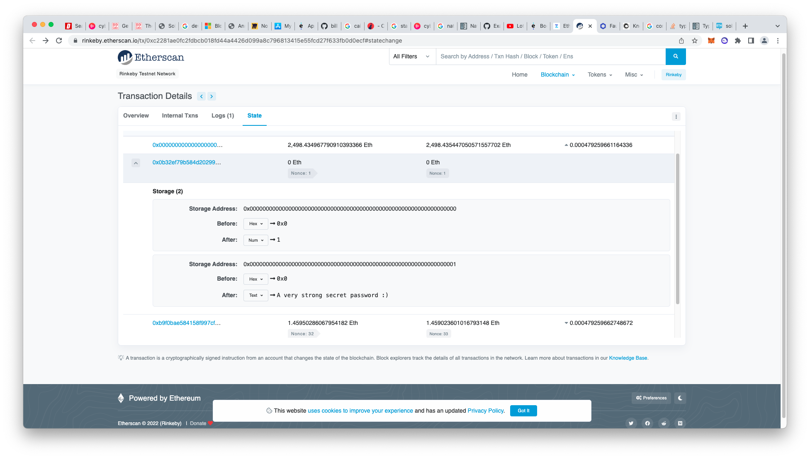

# 5. Vault Challenge
* Analysis

  ```
  // SPDX-License-Identifier: MIT
  pragma solidity ^0.6.0;

  contract Vault {
    bool public locked;
    bytes32 private password;

    constructor(bytes32 _password) public {
      locked = true;
      password = _password;
    }

    function unlock(bytes32 _password) public {
      if (password == _password) {
        locked = false;
      }
    }
  }
  ```

  Though the password is a private field, can't get the value of it from external or internal call. But it's part of the state of the contract on blockchain. We can get the password through etherscan:

  